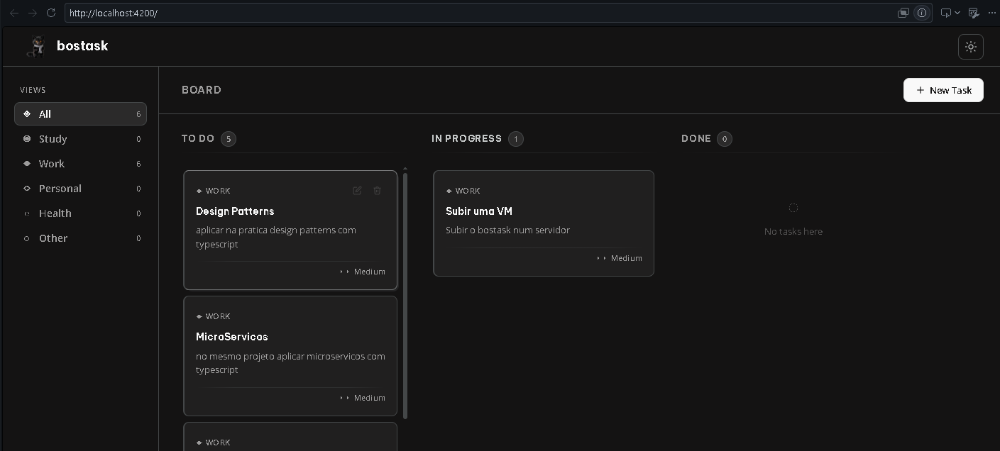
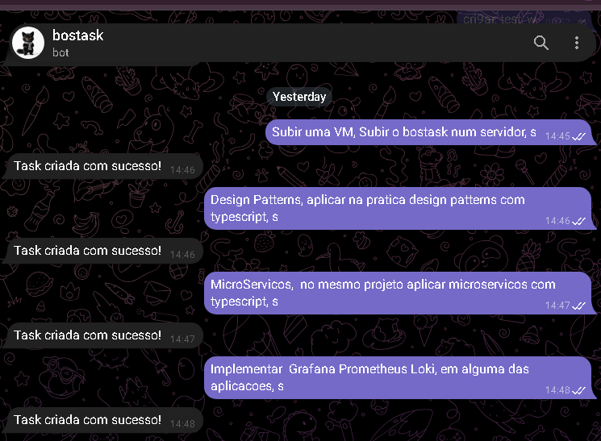

# bostask

[](https://nodejs.org/)
[](https://angular.io/)
[](https://www.typescriptlang.org/)
[](https://expressjs.com/)
[](https://www.mysql.com/)
[](https://telegraf.js.org/)

Aplicação full-stack para gerenciamento de tarefas em estilo Kanban integrada a um bot do Telegram para captura rápida de demandas, com interface web em Angular 17 baseada na identidade visual *Obsidian Sketch* (dark mode minimalista).

---

## Demonstração

### Quadro Kanban (Web)


### Criação de Tarefas via Telegram


---

## Funcionalidades

- **Quadro Kanban**: visualização e controle de fluxo em colunas (To Do, In Progress, Done).
- **Filtro por Categorias**: segmentação de tarefas por tags (Work, Study, Personal, etc.).
- **Integração com Telegram**: criação instantânea de tarefas enviando mensagens ao bot com confirmação imediata.
- **Design System Obsidian Sketch**: interface em dark mode com tons de carvão e tipografia limpa.
- **API REST em TypeScript**: backend estruturado em camadas (rotas, controllers, services e repositórios) rodando em Express 5.
- **Atualizações Dinâmicas**: suporte a atualizações parciais (`PATCH`) com query builder customizado para MySQL.

---

## Arquitetura do Projeto

```text
bostask/
├── assets/                     # Imagens e capturas de tela para documentação
├── core/                       # Backend (API REST & Bot do Telegram)
│   ├── api/task/               # Módulo de Tarefas (rotas, controllers, services, repositórios)
│   ├── database/               # Conexão MySQL, builders de query e schema SQL
│   ├── middleware/             # Middlewares globais de erro
│   ├── scripts/                # Script do bot do Telegram (bot.js)
│   ├── util/                   # Constantes e utilitários
│   ├── app.ts                  # Configuração do Express
│   ├── server.js               # Inicialização do servidor HTTP (porta 3000)
│   └── .env.example            # Exemplo de variáveis de ambiente
│
├── view/                       # Frontend (Angular 17)
│   ├── src/
│   │   ├── app/
│   │   │   ├── components/     # Componentes (Board, Column, TaskCard, Modals, Header, Sidebar)
│   │   │   ├── models/         # Interfaces e modelos de dados
│   │   │   ├── pipes/          # Pipes customizados (filtro por tag)
│   │   │   └── services/       # Serviços HTTP e de tema
│   │   ├── assets/             # Ícones e assets da aplicação web
│   │   └── styles.scss         # Estilos globais
│   ├── proxy.conf.json         # Proxy reverso de desenvolvimento para a porta 3000
│   └── DESIGN.md               # Especificação visual da identidade Obsidian Sketch
│
└── README.md
```

---

## Tecnologias

### Backend (`core`)
- Node.js (v20+ / v23+)
- Express 5 (com suporte a ESM e TypeScript)
- MySQL 2 (`mysql2/promise`)
- Telegraf (API de bots do Telegram)
- dotenv

### Frontend (`view`)
- Angular 17 (Standalone Components)
- Angular CDK (Drag and drop e utilitários)
- SCSS
- RxJS

---

## Pré-requisitos

- Node.js 20 ou superior (compatível com Node 23)
- MySQL Server 8.0+
- npm (ou gerenciador compatível)
- Token de bot no Telegram via [@BotFather](https://t.me/BotFather) (opcional, para uso do bot)

---

## Instalação e Configuração

### 1. Clonar o repositório

```bash
git clone https://github.com/DionathanDevs/bostask.git
cd bostask
```

---

### 2. Banco de Dados (MySQL)

Execute o script SQL disponível em `core/database/schema.sql` no seu cliente MySQL:

```sql
CREATE DATABASE IF NOT EXISTS bostask;
USE bostask;

CREATE TABLE IF NOT EXISTS tasks (
    id INT AUTO_INCREMENT PRIMARY KEY,
    title VARCHAR(255) NOT NULL,
    description TEXT,
    status INT NOT NULL DEFAULT 1,
    tag INT NOT NULL DEFAULT 1,
    created_at TIMESTAMP DEFAULT CURRENT_TIMESTAMP
);
```

---

### 3. Backend (`core`)

1. Entre na pasta `core`:
   ```bash
   cd core
   ```

2. Instale as dependências:
   ```bash
   npm install
   ```

3. Crie o arquivo `.env` a partir do exemplo:
   ```bash
   cp .env.example .env
   ```
   *(No Windows PowerShell: `copy .env.example .env`)*

4. Preencha os valores no `.env`:
   ```env
   HOST=127.0.0.1
   USER=root
   PASSWORD=sua_senha
   DATABASE=bostask
   BOT_TOKEN=seu_token_do_telegram_aqui
   URL_TASK=http://localhost:3000/task
   ```

5. Inicie o servidor da API:
   ```bash
   npm start
   ```
   O servidor iniciará em `http://localhost:3000`.

---

### 4. Bot do Telegram (Opcional)

Com o backend em execução, abra outro terminal dentro da pasta `core` e execute:

```bash
npm run bot
```

O bot ficará ativo aguardando comandos e mensagens.

---

### 5. Frontend (`view`)

1. Em um novo terminal, entre na pasta `view`:
   ```bash
   cd view
   ```

2. Instale as dependências:
   ```bash
   npm install
   ```

3. Inicie o servidor de desenvolvimento:
   ```bash
   npm start
   ```

4. Acesse no navegador:
   ```text
   http://localhost:4200
   ```

> As requisições direcionadas para `/api/*` são encaminhadas para a porta 3000 pelo `proxy.conf.json`.

---

## Uso do Bot do Telegram

Envie mensagens para o bot separando os campos por vírgula:

```text
Título da tarefa, Descrição detalhada, tag
```

- **Campo 1**: Título
- **Campo 2**: Descrição
- **Campo 3**: Tag (`s` para Trabalho/Estudo)

Exemplos:
```text
Subir uma VM, Subir o bostask num servidor, s
```
```text
Design Patterns, aplicar na pratica design patterns com typescript, s
```
```text
MicroServicos, no mesmo projeto aplicar microservicos com typescript, s
```

Ao processar a mensagem, o bot envia um `POST` para a API e retorna:
```text
Task criada com sucesso!
```

---

## Referência da API REST

Prefixo base: `/task`

| Método | Rota | Descrição | Exemplo de Body |
|---|---|---|---|
| `GET` | `/task` | Lista todas as tarefas | - |
| `GET` | `/task/:id` | Busca tarefa por ID | - |
| `POST` | `/task` | Cria nova tarefa | `{"title": "Subir uma VM", "description": "Subir o bostask num servidor", "status": 1, "tag": 1}` |
| `PATCH` | `/task/:id` | Atualiza campos da tarefa | `{"id": 1, "task": {"status": 2}}` |
| `DELETE` | `/task/:id` | Remove tarefa | - |

### Valores de Status
- `1`: To Do
- `2`: In Progress
- `3`: Done

### Valores de Tag
- `1`: Work
- `2`: Study

---

## Licença

Distribuído sob a licença [MIT](https://opensource.org/licenses/MIT).
